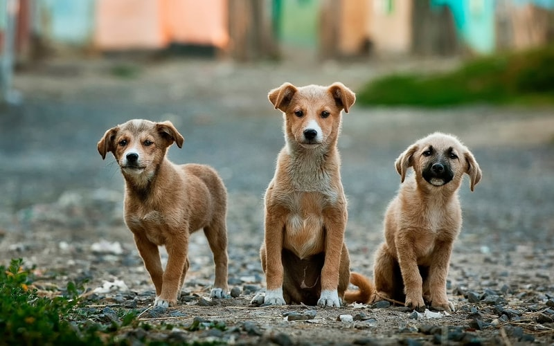

# PetRescue

Photo by <a href="https://unsplash.com/@anoirchafik">Anoir Chafik</a> on <a href="https://unsplash.com/s/photos/dogs">Unsplash</a>

## Problematica que atiende
México ocupa el primer lugar en población de perros callejeros. La mayoría de estos animales llegaron a las calles por descuido y negligencia. Esta situación no sólo afecta a los animalitos, también es un problema de salud pública. Pues los perros callejeros son transmisores de infecciones virales, gastrointestinales, dermatológicas y respiratorias. 

Muchas crías sin esterilizar son abandonadas. Si sobreviven, en muchos casos se reproducen, naciendo otra generación de caninos a vivir en el exterior. El panorama de los perros callejeros que ingresan a un albergue no es más alentador. En promedio, de cada 10 perros que llegan a los distintos albergues públicos, 9 son sacrificados.

## Propuesta de solución
PetRescue busca educar a la sociedad sobre la tenencia responsable a través de una plataforma que permita a los usuarios adoptar a un nuevo amigo. Cuando adoptamos un perrito, no sólo le aseguramos el cuidado y amor que no encontrará en la calle, sino también evitamos que toda una generación de perritos siga viviendo en esas condiciones.

## Definición de requerimientos del MVP

### Requerimientos funcionales
La aplicación deberá:

- Permitir a los nuevos usuarios registrarse:
  - El usuario deberá registrarse utilizando nombre, correo y clave ó una cuenta de Google.
  - Los datos de registro deben guardarse en firebase.
  - El formulario de registro debe contar con validaciones.
  - El diseño del formulario debe apegarse al elaborado.

- Permitir a los usuarios registrados iniciar sesión:
  - El usuario podrá iniciar sesión utilizando correo y clave o su cuenta de Google, dependiendo de la forma en la que realizó su registro.
  - El inicio de sesión debe realizarse accediendo o verificando los datos almacenados en firebase.
  - El formulario de inicio de sesión debe contar con validaciones.
  - El diseño del formulario debe apegarse al elaborado.

- Permitir a los usuarios ver la lista de caninos:
  - El usuario podrá ver un listado horizontal de cada refugio con la imágen de cada canino, su nombre (opcional) y un icono que permita agregar sus favoritos.
  - La información debe recuperarse desde firebase.
  - El diseño del listado debe apegarse al proporcionado.

- Permitir a los usuarios ver su lista de favoritos.
  - Mostrar un listado vertical de los caninos que ha marcado como favoritos el usuario.

- Pemitir a los usuarios ver su perfil.
  - El usuario podrá editar sus datos personales, su foto de perfil, su correo y su contraseña.

- Permitir agregar nuevos caninos.
  - Cada refugio al agregar a un nuevo canino deberá especificar el nombre del canino para identificarlo, imágenes claras del canino, tamaño, aproximación de edad, raza y si está esterilizado.
  - La información debe guardarse en firebase.
  - El diseño para el registro de caninos debe apegarse al proporcionado.

- Página de detalles:
  - El usuario podrá ver una foto del canino, con una descripción que incluya su nombre, sexo, vacunas, raza, edad, tamaño, si está esterilizado y si cuenta con alguna enfermedad.
  - El usuario se podrá poner en contacto a través de un modal que incluirá la información del refugio que realizó la publicación.

### Requerimientos no funcionales
 - Base de datos
   - La información se guardará en firebase
 - Calidad
   - Utilizar un estilo de código estandarizado (revisado por Eslint)
   - Incluir pruebas unitarias
   - Puntuación **A** obtenida en CodeClimate
- Ejecución 
   - Puede ejecutarse en Android o iOs
- Diseño
   - Debe ser lo más cercano posible al proporcionado
- Código fuente
   - Orientado a Objetos
   - Métodos pequeños
   - Aplicar los principios [SOLID](https://blog.usejournal.com/how-to-apply-solid-principles-in-react-applications-6c964091a982)
 - Manejo del estado
   - Redux para el manejo del estado de la App

## Diseño del MVP
En la carpeta [design](/design) se encuentra la propuesta de diseño

## Recursos
- [Minimum Viable Product](https://www.agilealliance.org/glossary/mvp/#q=~(infinite~false~filters~(tags~(~'mvp))~searchTerm~'~sort~false~sortDirection~'asc~page~1))
- [Minimum Viable Product (MVP)](https://www.productplan.com/glossary/minimum-viable-product/)
- [Design Thinking](https://www.interaction-design.org/literature/topics/design-thinking)
- [El proceso de pensamiento de diseño](https://www.youtube.com/watch?v=_r0VX-aU_T8)
- [Metodología Design Thinking. Ejemplos](https://www.youtube.com/watch?v=_ul3wfKss58) 
- [Design Thinking ejemplo sencillo](https://www.youtube.com/watch?v=_H33tA2-j0s)